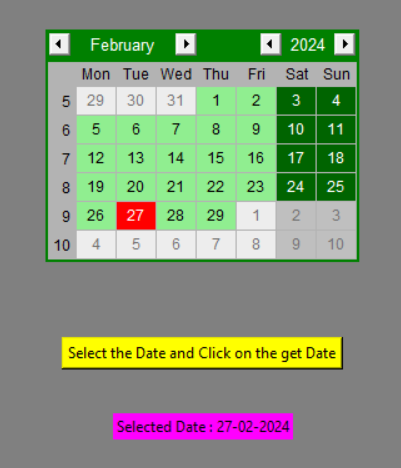

# week2-Project-2-Using-Tkinter-to-build-GUI-Calendar
# Tkinter Calendar

This is a simple calendar application built using Tkinter, a standard GUI (Graphical User Interface) toolkit in Python.

## Features

- Display a calendar interface with the current month and year.
- Navigate between months using next and previous buttons.
- Easily select  specific dates.

## Requirements

- Python 3.x
- Tkinter (usually included with Python)

## Installation

1. Clone the repository:

   ```
      git clone https://github.com/BhawarSuthar7023/week2-Project-2-Using-Tkinter-to-build-GUI-Calendar.git
   ```
2. Change directory to the project folder:
  ```
      cd week2-Project-2-Using-Tkinter-to-build-GUI-Calendar
  ```

3. Run the application:
   ```
      python tk_Calender.py
   ```
Example:

## Contributions
Contributions to this project are welcome! If you have any suggestions, bug reports, or feature requests, feel free to open an issue or create a pull request.
---
Enjoy tkinter calender ! If you encounter any issues or have any questions, don't hesitate to reach out.